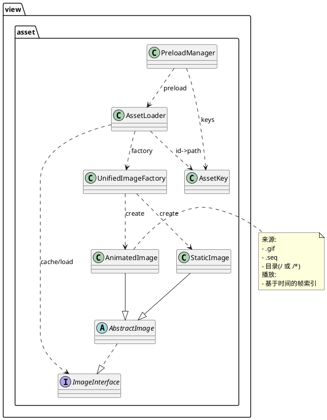
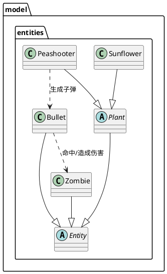
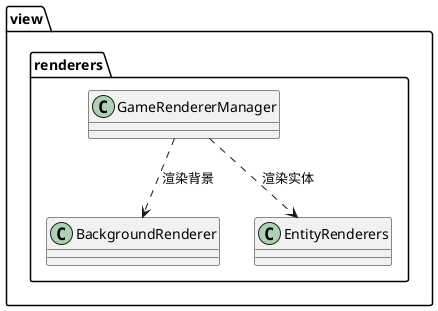

# 项目 UML 图（继承关系）

说明：
- 使用 PlantUML 语法描述主要继承关系，便于阅读与维护。
- 可在 IDE 安装 PlantUML 插件或使用在线渲染预览。

## 资源模块（view.asset）

```plantuml
@startuml
package "view.asset" {
  interface ImageInterface
  abstract class AbstractImage
  class StaticImage
  class AnimatedImage
  class UnifiedImageFactory
  class AssetLoader
  class AssetKey
  class PreloadManager
}

AbstractImage ..|> ImageInterface
StaticImage --|> AbstractImage
AnimatedImage --|> AbstractImage

UnifiedImageFactory ..> StaticImage : create
UnifiedImageFactory ..> AnimatedImage : create

AssetLoader ..> ImageInterface : cache/load
AssetLoader ..> UnifiedImageFactory : factory
AssetLoader ..> AssetKey : id->path
PreloadManager ..> AssetLoader : preload
PreloadManager ..> AssetKey : keys

note right of AnimatedImage
  来源:
  - .gif
  - .seq
  - 目录(/ 或 /*)
  播放:
  - 基于时间的帧索引
end note
@enduml
```

## 实体模块（model.entities）

```plantuml
@startuml
package "model.entities" {
  abstract class Entity
  abstract class Plant
  class Sunflower
  class Peashooter
  class Zombie
  class Bullet
}

Plant --|> Entity
Sunflower --|> Plant
Peashooter --|> Plant
Zombie --|> Entity
Bullet --|> Entity

Peashooter ..> Bullet : 生成子弹
Bullet ..> Zombie : 命中/造成伤害
@enduml
```

## 渲染模块（view.renderers）

```plantuml
@startuml
package "view.renderers" {
  class BackgroundRenderer
  class EntityRenderers
  class GameRendererManager
}

GameRendererManager ..> BackgroundRenderer : 渲染背景
GameRendererManager ..> EntityRenderers : 渲染实体
@enduml
```
